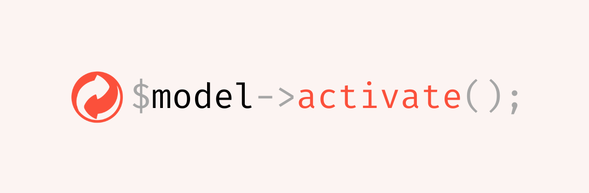

# 🔁 Laravel Model Status



[](https://packagist.org/packages/thefeqy/laravel-model-status)
[](https://packagist.org/packages/thefeqy/laravel-model-status)
[](https://php.net)

[](LICENSE)

A Laravel package that simplifies **status management** for Eloquent models.

---

## **Table of Contents**
- [Features](#features)
- [Installation](#installation)
    - [Step 1: Run the Installation Command](#step-1-run-the-installation-command)
- [Configuration](#configuration)
    - [Using `.env` Variables](#using-env-variables)
- [Usage](#usage)
    - [Using the `HasActiveScope` Trait](#using-the-hasactivescope-trait)
    - [Querying Models](#querying-models)
    - [Using Status Casting](#using-status-casting)
    - [Cascade Deactivation](#cascade-deactivation)
    - [Using the Middleware](#using-the-middleware)
    - [Add Middleware to Routes](#add-middleware-to-routes)

- [Admin Bypass for Active Scope](#admin-bypass-for-active-scope)
- [Advanced Configuration](#advanced-configuration)
- [Testing](#testing)
- [Security](#security)
- [Contributing](#contributing)
- [License](#license)

---

## Features
- **`HasActiveScope` Trait**: Automatically filters models with active status.
- **Admin Bypass**: Admin users can see all models, including inactive ones.
- **Helper Methods**: `$model->status->isActive()` and `$model->status->isInactive()`.
- **Dynamic Configuration**: Define custom statuses & column names via `.env`.
- **Installation Command**: `php artisan model-status:install` for easy setup.
- **PHP 8.3 Support**.

---

## Installation
You can install the package via Composer:

```bash
composer require thefeqy/laravel-model-status
```

### Step 1: Run the Installation Command
```bash
php artisan model-status:install
```

This will:

- Publish the config file (`config/model-status.php`).
- Set up required environment variables in `.env` and `.env.example`.
- Ensure your project is ready to use the package.

---

## Configuration
You can customize the package settings in:

`config/model-status.php`
```php
return [
    'column_name' => env('MODEL_STATUS_COLUMN', 'status'),
    'default_value' => env('MODEL_STATUS_ACTIVE', 'active'),
    'inactive_value' => env('MODEL_STATUS_INACTIVE', 'inactive'),

    'admin_detector' => function () {
        return auth()->check() && auth()->user()->is_admin;
    },
];
```
### Using .env Variables
Instead of modifying `config/model-status.php`, you can override values in .env:

`.env`

```dotenv
MODEL_STATUS_COLUMN=state
MODEL_STATUS_ACTIVE=enabled
MODEL_STATUS_INACTIVE=disabled
```
Now, the package will automatically adapt to your setup.

## Usage

### Using the HasActiveScope Trait
To enable status management in a model:

```php
use Thefeqy\ModelStatus\Traits\HasActiveScope;

class Product extends Model
{
    use HasActiveScope;

    protected $fillable = ['name'];
}
```
Now, inactive models are automatically excluded from queries.

--- 

### Querying Models
Get Active Models (Default Behavior)
```php
$activeProducts = Product::all(); // Returns only active products
```
Get All Models (Including Inactive)
```php
$allProducts = Product::inActive()->get();
```
Manually Activating / Deactivating a Model
```php
$product = Product::find(1);

$product->activate(); // Set status to "active"
$product->deactivate(); // Set status to "inactive"
```

Checking a Model's Status
```php
if ($product->status->isActive()) {
    echo "Product is active!";
}

if ($product->status->isInactive()) {
    echo "Product is inactive!";
}
```
---

### Using Status Casting

To ensure `status` is always cast to a `Status` object, use the `StatusCast` class.

#### Apply Status Casting in Models
```php
use Thefeqy\ModelStatus\Casts\StatusCast;

class Product extends Model
{
    use HasActiveScope;

    protected $fillable = ['name', 'status', 'category_id'];

    protected $casts = [
        'status' => StatusCast::class,
    ];
}
```

#### Example Usage
```php
$product = Product::find(1);

if ($product->status->isActive()) {
    echo "Product is active!";
}
```

Now, `$product->status` is an instance of `Status`, allowing method calls like `isActive()` and `isInactive()`.

---

### Cascade Deactivation

If a model is deactivated, its related models can also be **automatically deactivated**.

#### Example
```php
class Category extends Model
{
    use HasActiveScope;

    protected $fillable = ['name', 'status'];

    protected array $cascadeDeactivate = ['products'];

    public function products()
    {
        return $this->hasMany(Product::class);
    }
}
```
Now, deactivating a **category** will also **deactivate all products** under it:
```php
$category = Category::find(1);
$category->deactivate();
```

---
### Using the Middleware

The package includes the `EnsureAuthenticatedUserIsActive` middleware, which enforces that only users with an active status can access certain routes.

#### Add Middleware to Routes
Instead of registering a string alias for the middleware, you can reference it by class name in your route definition:

```php
use Illuminate\Support\Facades\Route;
use Thefeqy\ModelStatus\Middleware\EnsureAuthenticatedUserIsActive;

Route::middleware(['auth', EnsureAuthenticatedUserIsActive::class])->group(function () {
    Route::get('/dashboard', function () {
        return 'Welcome to your dashboard!';
    });
});
```

---

## Admin Bypass for Active Scope
By default, admin users can see inactive models.

This behavior is controlled in `config/model-status.php`:

```php
'admin_detector' => function () {
    return auth()->check() && auth()->user()->is_admin;
},
```
---

## Advanced Configuration
If you need a different column name or status values, update `.env`:

```dotenv
MODEL_STATUS_COLUMN=state
MODEL_STATUS_ACTIVE=enabled
MODEL_STATUS_INACTIVE=disabled
```
Now, models will use:

```php
$table->string('state', 10)->default('enabled');
```
instead of:

```php
$table->string('status', 10)->default('active');
```

## Testing
Run tests using Pest PHP:

```sh
composer test
or
vendor/bin/phpunit
```

## Security
If you discover a security vulnerability, please report it via email:
📩 [thefeqy@gmail.com](mailto:thefeqy@gmail.com)   

## Contributing

Want to improve this package? Check out [CONTRIBUTING](CONTRIBUTING.md) for contribution guidelines.

## License

This package is open-source software licensed under the [MIT License](LICENSE).
